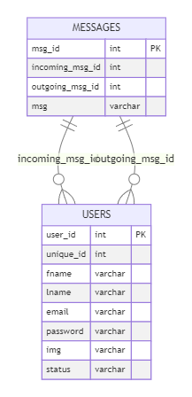
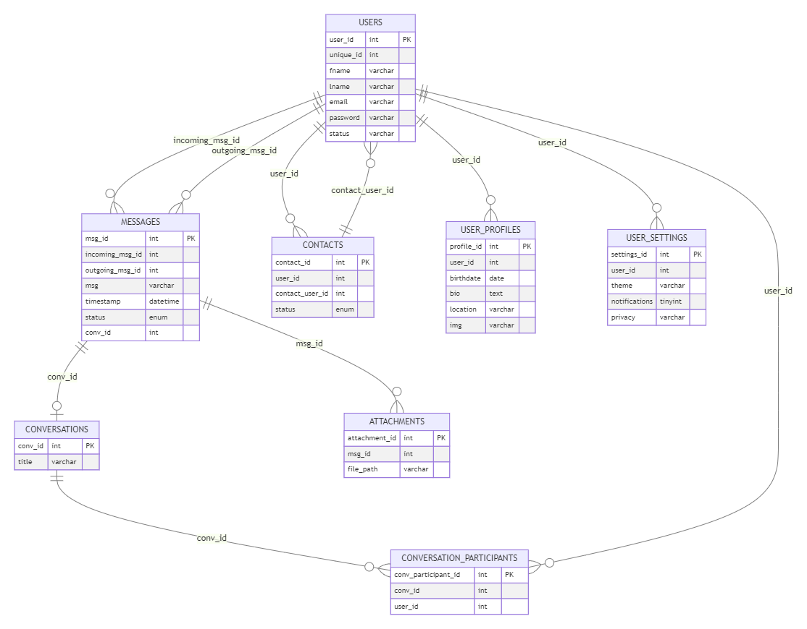

[](https://www.php.net/)
[](https://developer.mozilla.org/en-US/docs/Web/JavaScript)
[](https://www.mysql.com/)

# DATABASESYSTEMS ASSIGNMENT (DBA20)
# MYSQL + PHP CHAT DEVELOPMENT

## Program Execution
### Xampp
[DOWNLOAD](https://www.apachefriends.org/download.html)

### Visual Studio Code
IT IS RECOMMENDED TO LAUNCH THE [PHP EXTENSION PACK](https://marketplace.visualstudio.com/items?itemName=xdebug.php-pack) APPLICATION WITH [VISUAL STUDIO CODE](https://code.visualstudio.com/).

-------------------------------------------------------
## ER diagram & UML

### Simple chat:



### Complex chat:




-------------------------------------------------------
## Database schema

### Simple chat:

```
--
-- Database: `chat_db`
--

-- --------------------------------------------------------

--
-- Table structure for table `messages`
--

CREATE TABLE `messages` (
  `msg_id` int(11) NOT NULL,
  `incoming_msg_id` int(255) NOT NULL,
  `outgoing_msg_id` int(255) NOT NULL,
  `msg` varchar(1000) NOT NULL
) ENGINE=InnoDB DEFAULT CHARSET=utf8mb4;

-- --------------------------------------------------------

--
-- Table structure for table `users`
--

CREATE TABLE `users` (
  `user_id` int(11) NOT NULL,
  `unique_id` int(255) NOT NULL,
  `fname` varchar(255) NOT NULL,
  `lname` varchar(255) NOT NULL,
  `email` varchar(255) NOT NULL,
  `password` varchar(255) NOT NULL,
  `img` varchar(255) NOT NULL,
  `status` varchar(255) NOT NULL
) ENGINE=InnoDB DEFAULT CHARSET=utf8mb4;

--
-- Indexes for dumped tables
--

--
-- Indexes for table `messages`
--
ALTER TABLE `messages`
  ADD PRIMARY KEY (`msg_id`);

--
-- Indexes for table `users`
--
ALTER TABLE `users`
  ADD PRIMARY KEY (`user_id`);

--
-- AUTO_INCREMENT for dumped tables
--

--
-- AUTO_INCREMENT for table `messages`
--
ALTER TABLE `messages`
  MODIFY `msg_id` int(11) NOT NULL AUTO_INCREMENT;

--
-- AUTO_INCREMENT for table `users`
--
ALTER TABLE `users`
  MODIFY `user_id` int(11) NOT NULL AUTO_INCREMENT;
COMMIT;
```


### Complex chat:

```
-- Create `users` table
CREATE TABLE `users` (
  `user_id` int(11) NOT NULL AUTO_INCREMENT,
  `unique_id` int(255) NOT NULL,
  `fname` varchar(255) NOT NULL,
  `lname` varchar(255) NOT NULL,
  `email` varchar(255) NOT NULL,
  `password` varchar(255) NOT NULL,
  `status` varchar(255) NOT NULL,
  PRIMARY KEY (`user_id`)
) ENGINE=InnoDB DEFAULT CHARSET=utf8mb4;

-- Create `conversations` table
CREATE TABLE `conversations` (
  `conv_id` int(11) NOT NULL AUTO_INCREMENT,
  `title` varchar(255) DEFAULT NULL,
  PRIMARY KEY (`conv_id`)
) ENGINE=InnoDB DEFAULT CHARSET=utf8mb4;

-- Create `messages` table
CREATE TABLE `messages` (
  `msg_id` int(11) NOT NULL AUTO_INCREMENT,
  `incoming_msg_id` int(11) NOT NULL,
  `outgoing_msg_id` int(11) NOT NULL,
  `msg` varchar(1000) NOT NULL,
  `timestamp` datetime NOT NULL DEFAULT CURRENT_TIMESTAMP,
  `status` enum('sent', 'delivered', 'read') NOT NULL DEFAULT 'sent',
  `conv_id` int(11) DEFAULT NULL,
  PRIMARY KEY (`msg_id`),
  FOREIGN KEY (`incoming_msg_id`) REFERENCES `users`(`user_id`),
  FOREIGN KEY (`outgoing_msg_id`) REFERENCES `users`(`user_id`),
  FOREIGN KEY (`conv_id`) REFERENCES `conversations`(`conv_id`)
) ENGINE=InnoDB DEFAULT CHARSET=utf8mb4;

-- Create `contacts` table
CREATE TABLE `contacts` (
  `contact_id` int(11) NOT NULL AUTO_INCREMENT,
  `user_id` int(11) NOT NULL,
  `contact_user_id` int(11) NOT NULL,
  `status` enum('pending', 'accepted', 'blocked') NOT NULL DEFAULT 'pending',
  PRIMARY KEY (`contact_id`),
  FOREIGN KEY (`user_id`) REFERENCES `users`(`user_id`),
  FOREIGN KEY (`contact_user_id`) REFERENCES `users`(`user_id`)
) ENGINE=InnoDB DEFAULT CHARSET=utf8mb4;

-- Create `conversation_participants` table
CREATE TABLE `conversation_participants` (
  `conv_participant_id` int(11) NOT NULL AUTO_INCREMENT,
  `conv_id` int(11) NOT NULL,
  `user_id` int(11) NOT NULL,
  PRIMARY KEY (`conv_participant_id`),
  FOREIGN KEY (`conv_id`) REFERENCES `conversations`(`conv_id`),
  FOREIGN KEY (`user_id`) REFERENCES `users`(`user_id`)
) ENGINE=InnoDB DEFAULT CHARSET=utf8mb4;

-- Create `user_profiles` table
CREATE TABLE `user_profiles` (
  `profile_id` int(11) NOT NULL AUTO_INCREMENT,
  `user_id` int(11) NOT NULL,
  `birthdate` date DEFAULT NULL,
  `bio` text DEFAULT NULL,
  `location` varchar(255) DEFAULT NULL,
  `img` varchar(255) NOT NULL, -- Added column for profile image
  PRIMARY KEY (`profile_id`),
  FOREIGN KEY (`user_id`) REFERENCES `users`(`user_id`)
) ENGINE=InnoDB DEFAULT CHARSET=utf8mb4;

-- Create `user_settings` table
CREATE TABLE `user_settings` (
  `settings_id` int(11) NOT NULL AUTO_INCREMENT,
  `user_id` int(11) NOT NULL,
  `theme` varchar(255) DEFAULT 'light',
  `notifications` tinyint(1) DEFAULT 1,
  `privacy` varchar(255) DEFAULT 'friends_only',
  PRIMARY KEY (`settings_id`),
  FOREIGN KEY (`user_id`) REFERENCES `users`(`user_id`)
) ENGINE=InnoDB DEFAULT CHARSET=utf8mb4;

-- Create `attachments` table
CREATE TABLE `attachments` (
  `attachment_id` int(11) NOT NULL AUTO_INCREMENT,
  `msg_id` int(11) NOT NULL,
  `file_path` varchar(255) NOT NULL,
  PRIMARY KEY (`attachment_id`),
  FOREIGN KEY (`msg_id`) REFERENCES `messages`(`msg_id`)
) ENGINE=InnoDB DEFAULT CHARSET=utf8mb4;

```


-------------------------------------------------------
## PHP-Chat Projektstruktur
```
php-chat
├─ assets
│  ├─ css
│  │  └─ style.css
│  ├─ model
│  │  ├─ complex_chat_ER_diagram.mmd
│  │  ├─ complex_UML.puml
│  │  ├─ simple_chat_ER_diagram.mmd
│  │  └─ simple_UML.puml
│  └─ sql
│     ├─ complex_chat_db.sql
│     └─ simple_chat_db.sql
├─ chat.php
├─ header.php
├─ index.php
├─ info.php
├─ javascript
│  ├─ chat.js
│  ├─ login.js
│  ├─ pass-show-hide.js
│  ├─ signup.js
│  └─ users.js
├─ login.php
├─ out
│  └─ assets
│     └─ model
│        ├─ complex_ER_diagram
│        │  └─ complex_chat_ER_diagram.mmd.png
│        ├─ complex_UML
│        │  └─ complex_UML.png
│        ├─ simple_ER_diagram
│        │  └─ simple_chat_ER_diagram.mmd.png
│        └─ simple_UML
│           └─ simple_UML.png
├─ php
│  ├─ config.php
│  ├─ confirm_password.php
│  ├─ data.php
│  ├─ get-chat.php
│  ├─ images
│  │  ├─ 1715077867user1-avatar.gif
│  │  ├─ 1715078174user2-avatar.jpeg
│  │  ├─ 1715083162user3-avatare.jpg
│  │  └─ default.jpg
│  ├─ insert-chat.php
│  ├─ login.php
│  ├─ logout.php
│  ├─ search.php
│  ├─ signup.php
│  └─ users.php
├─ README.md
├─ unzipper.php
└─ users.php

```

## Credits

### Creator

**Davain Pablo Edwards**

---
## License

GNU General Public License Version 3

Copyright (c) 2024 Davain Pablo Edwards


This program is free software: you can redistribute it and/or modify it under the terms of the GNU General Public License as published by the Free Software Foundation, either version 3 of the License, or (at your option) any later version.

This program is distributed in the hope that it will be useful, but WITHOUT ANY WARRANTY; without even the implied warranty of MERCHANTABILITY or FITNESS FOR A PARTICULAR PURPOSE. See the GNU General Public License for more details.

For further information regarding the license, please see: <http://www.gnu.org/licenses/>.

